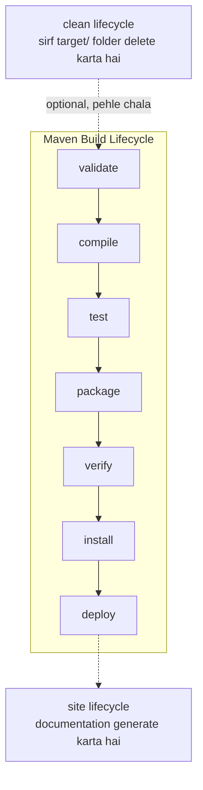

# Maven (ekdum simple bhasha mein, jaise ek chote bacche ko samjhaya jaata hai)

## Maven hai kya?

Socho tumhe Lego se ek gaadi banani hai. Tumhe pehle sare parts chahiye,
phir unhe sahi tarike se jodna hai, phir check karna hai sab sahi lag raha
hai ya nahi. Maven bhi bilkul yehi karta hai, bas Lego blocks ki jagah
**Java code** ke saath.

Maven ek **tool** hai jo:
1. Tumhare project ko chahiye hone wali saari cheezein (libraries) khud
   dhundh ke laa deta hai.
2. Tumhara code compile (ready) karta hai.
3. Test karta hai sab sahi chal raha hai ya nahi.
4. Aakhir mein sab kuch ek box (`.jar` ya `.war` file) mein pack kar deta
   hai, jise chalaya ja sake.

Agar ye sab tumhe khud haath se karna pade, to bahut time lagega aur
galtiyan bhi ho sakti hai. Isliye Maven use karte hai — bas usse bata do
"mujhe ye chahiye" aur wo sab kaam khud kar deta hai.

Har Maven project ke andar ek `pom.xml` naam ki file hoti hai (Project
Object Model). Ye file project ka **ID card** hai — isme likha hota hai:
- project ka naam, version, aur type (jar hai ya war)
- **dependencies** — konsi extra libraries chahiye (jaise Spring, JUnit)
- **plugins** — extra kaam karne ke liye (jaise specific Java version pe
  compile karna)

## Maven use kyu karte hai?

Agar Maven na ho, to:

1. **Libraries khud dhundhni padegi** — har ek `.jar` file manually
   download karni padegi, aur unki apni dependencies bhi khud sambhalni
   padegi. Bohot jhanjhat hai. Maven `pom.xml` padh ke sab khud download
   kar leta hai.
2. **Har project ka structure same rehta hai** — ek baar samajh liya, to
   har Maven project mein confuse nahi hoge ki "code kahan rakha hai".
3. **Build hamesha same result deta hai** — chahe tumhare laptop pe chalao
   ya dost ke laptop pe, result same aayega.
4. **Sab kaam ek hi jagah se ho jaata hai** — compile, test, package, sab
   ek hi command se.
5. **Naye features add karna easy hai** — plugins add karke.

## Maven use karne ke steps

1. **Maven install karo** aur check karo sahi se install hua ya nahi:
   ```
   mvn -version
   ```
2. **Naya project banao** (ek ready-made template se), ya jo already
   `pom.xml` wala project hai wo kholo:
   ```
   mvn archetype:generate -DgroupId=com.example -DartifactId=my-app \
       -DarchetypeArtifactId=maven-archetype-quickstart -DinteractiveMode=false
   ```
3. **Folder structure samjho** jo Maven khud banata hai:
   ```
   my-app/
   ├── pom.xml
   └── src/
       ├── main/
       │   ├── java/        <- tumhara actual code yahan
       │   └── resources/   <- config files waghera yahan
       └── test/
           └── java/        <- test wala code yahan
   ```
4. **Dependencies daalo** `pom.xml` ke `<dependencies>` tag ke andar
   (jaise Spring Boot, JUnit) — Maven khud download kar lega.
5. **Project build karo** — project ke root folder se (jahan `pom.xml`
   hai) ye commands chalao:
   - `mvn compile` — sirf code compile karta hai (ready karta hai)
   - `mvn test` — saare tests chalata hai
   - `mvn package` — compiled code ko `.jar`/`.war` bana ke `target/`
     folder mein daal deta hai
   - `mvn install` — us package ko apne local Maven ghar
     (`~/.m2`) mein rakh deta hai, taaki dusre local projects bhi ise
     use kar sake
   - `mvn clean` — `target/` folder delete karke fresh start deta hai
   (Har command apne se pehle wale steps bhi khud kar leta hai — jaise
   `mvn package` chalane se pehle compile aur test bhi ho jaate hai.)
6. **Bana hua jar chalao**:
   ```
   java -jar target/my-app-1.0.jar
   ```
   Spring Boot app ke liye `mvn spring-boot:run` seedha shortcut hai.

## Archetype kya hota hai?

**Archetype** ek **ready-made template** hai jo batata hai naya Maven
project kaise dikhega (kaunse folders honge, kaunsi starting files
honge). Isko aise socho jaise kisi form ka **printed format** hota hai —
tumhe bas blanks fill karne hai, poora form khud se nahi banana padta.

Do common archetypes:
- `maven-archetype-quickstart` → simple, standalone Java application ke
  liye (koi website nahi, bas normal Java program).
  ```
  mvn archetype:generate -DgroupId=com.example -DartifactId=my-app \
      -DarchetypeArtifactId=maven-archetype-quickstart -DarchetypeVersion=1.0 \
      -DinteractiveMode=false
  ```
- `maven-archetype-webapp` → Java **web application** ke liye (jo browser
  mein khulti hai).
  ```
  mvn archetype:generate -DgroupId=com.telusko -DartifactId=telusko-web-app \
      -DarchetypeArtifactId=maven-archetype-webapp -DarchetypeVersion=1.0 \
      -DinteractiveMode=false
  ```

## Maven Terminologies (chote-chote basic naam)

- **Group ID** — batata hai project **kiski company/organization** ka hai.
  Ye ulta domain naam ki tarah likha jaata hai (jaise `com.tcs`,
  `com.ibm`, `com.telusko`). Isko school ke naam ki tarah socho — batata
  hai ye project kis "school" (company) se hai.
- **Artifact ID** — is **particular project ya module** ka naam (jaise
  `telusko-app`, `amazon-app`). Isko tumhare apne naam ki tarah socho —
  batata hai *exactly kaunsa* project hai.
- **Version** — project ka number, jaise kis "class" mein hai
  (`1.0`, `2.0`, ya `1.0-SNAPSHOT`). `SNAPSHOT` ka matlab hai "abhi bhi
  bana raha hu, final nahi hua" — jaise homework abhi complete nahi hua.
  Plain number jaise `1.0` ka matlab "ye final, ready version hai".
- **Packaging Type** — project akhir mein kis **dabbe (box)** mein pack
  hoga: `jar` (normal Java program ke liye, sabse common), `war` (web
  application ke liye), ya `pom` (sirf doosre projects ko group karne ke
  liye, khud ka code nahi hota).

## Maven Dependencies (extra cheezein jo chahiye)

**Dependencies** wo external libraries hai jo tumhare project ko chalne
ke liye chahiye — jaise school bag mein pencil aur eraser chahiye hote
hai, waise hi project ko Spring, Hibernate, JUnit, Kafka, Redis jaisi
cheezein chahiye ho sakti hai.

Ye libraries kahan se milti hai? [mvnrepository.com](https://mvnrepository.com)
pe jaake dhundh sakte ho, aur wahan se copy karke `pom.xml` mein
`<dependencies>` tag ke andar daal do:

```xml
<dependencies>
    <dependency>
        <groupId>org.springframework</groupId>
        <artifactId>spring-core</artifactId>
        <version>6.1.7</version>
    </dependency>
</dependencies>
```

Isko daalte hi Maven khud us library ko download karke tumhare project
mein use karne layak bana deta hai — tumhe kahin se `.jar` file khud
dhundhni nahi padti.

## Maven Build Lifecycle (build ke steps)

Maven mein **3 alag lifecycles** hote hai — inhe socho jaise 3 alag
"to-do lists", jo apna kaam khatam karke apna result deti hai:

1. **default** — sabse important lifecycle, jisse tumhara **application
   actually build hota hai** (compile, test, package waghera). Ye hi
   sabse zyada use hota hai.
2. **clean** — sirf ek kaam karta hai: `target/` directory ko **saaf**
   (delete) kar deta hai, taaki purani build ka kachra na rahe.
3. **site** — tumhare project ki **documentation** (website jaisi report)
   generate karta hai.

`default` lifecycle ke andar 7 phases hote hai, hamesha isi order mein
chalte hai:

```
validate → compile → test → package → verify → install → deploy
```

- **validate** — check karta hai project ka structure sahi hai, sab
  info (jaise `pom.xml`) correct hai ya nahi.
- **compile** — `.java` files ko `.class` files mein badalta hai.
- **test** — likhe hue unit tests chala ke check karta hai code sahi
  kaam kar raha hai ya nahi.
- **package** — compiled code ko `.jar`/`.war` file mein wrap karta hai.
- **verify** — package ke checks/validations karta hai ki wo sahi bana
  hai aur quality theek hai.
- **install** — us package ko apne local repo (`~/.m2`) mein daal deta
  hai, taaki dusre local projects use kar sake.
- **deploy** — final package ko ek shared/remote repository pe bhej deta
  hai, taaki dusre developers ya servers bhi use kar sake.

Jab tum koi bhi phase chalate ho (jaise `mvn package`), Maven us se
**pehle wale saare phases bhi khud chala deta hai** — matlab
`mvn package` likhne se validate, compile, aur test bhi apne aap ho
jaate hai, tumhe alag se likhna nahi padta.

### Flow chart (GitHub pe seedha diagram dikhega)



- Upar wali seedhi line (`validate → ... → deploy`) **default**
  lifecycle hai — ye asli build ka kaam karti hai.
- `clean` alag lifecycle hai, jo chaho to `default` se pehle chala sakte
  ho (jaise `mvn clean install`) taaki purana `target/` folder pehle hat
  jaaye.
- `site` bhi apna alag lifecycle hai, documentation banane ke liye —
  isko `default` ke saath jodne ki zaroorat nahi, jab chaho tab alag se
  `mvn site` chala sakte ho.

- **Phase** ek **stage/step** ka naam hai (jaise `compile`, `test`,
  `package`).
- **Goal** ek **chota, specific kaam** hai jo kisi phase ke andar actually
  hota hai (jaise `compiler:compile`, `surefire:test`). Seedha ek goal
  chalane ka command hota hai:
  ```
  mvn <goal>
  ```
  Ek phase ke andar ek ya zyada goals chupe hote hai — phase bas ek label
  hai, goal wo asli kaam hai jo ho raha hai.

### `mvn compile` aur `mvn clean` mein farak

- `mvn compile` — tumhara `.java` code check karke `.class` files banata
  hai aur unhe `target/` folder mein rakh deta hai.
- `mvn clean` — us `target/` folder ko **delete** kar deta hai, taaki
  agli baar fresh, saaf-suthri build ho.
- `mvn package` — compile + test karne ke baad sab kuch ek `.jar`/`.war`
  file mein wrap kar deta hai, taaki chalane/distribute karne layak ho
  jaaye.
- `mvn clean package` — pehle purani `target/` folder delete hoti hai
  (`clean`), fir usi jagah bilkul **naya, fresh jar/war** ban ke aata hai
  (`package`). Ye "delete karke package ko khatam" nahi karta — ulta, ye
  purana build hata ke ek naya, sahi build bana deta hai.

## `pom.xml` ka example (sab kuch ek jagah)

```xml
<project xmlns="http://maven.apache.org/POM/4.0.0"
         xmlns:xsi="http://www.w3.org/2001/XMLSchema-instance"
         xsi:schemaLocation="http://maven.apache.org/POM/4.0.0 http://maven.apache.org/maven-v4_0_0.xsd">

    <modelVersion>4.0.0</modelVersion>

    <groupId>com.telusko</groupId>
    <artifactId>telusko-app</artifactId>
    <version>1.0-SNAPSHOT</version>
    <packaging>jar</packaging>

    <name>telusko-app</name>
    <url>http://maven.apache.org</url>

    <properties>
        <maven.compiler.source>17</maven.compiler.source>
        <maven.compiler.target>17</maven.compiler.target>
        <project.build.sourceEncoding>UTF-8</project.build.sourceEncoding>
    </properties>

    <dependencies>
        <dependency>
            <groupId>junit</groupId>
            <artifactId>junit</artifactId>
            <version>3.8.1</version>
            <scope>test</scope>
        </dependency>
    </dependencies>

    <build>
        <plugins>
            <plugin>
                <groupId>org.apache.maven.plugins</groupId>
                <artifactId>maven-compiler-plugin</artifactId>
                <version>3.13.0</version>
                <configuration>
                    <source>17</source>
                    <target>17</target>
                </configuration>
            </plugin>
        </plugins>
    </build>

</project>
```

Isko edit karne ke liye terminal mein `vi pom.xml` likh ke seedha khol
sakte ho. Har tag ka matlab upar "Maven Terminologies" section mein
already explain ho chuka hai (groupId, artifactId, version, packaging,
dependencies).

## Maven Repositories (dependencies kahan store hoti hai)

Repository ek **gudaam/warehouse** jaisi jagah hai jahan Maven
dependencies (libraries) rakhta hai aur wahan se uthata hai. Teen type
hote hai:

1. **Local Repository** — tumhare **apne machine** pe hota hai, folder
   ka naam `~/.m2/repository`. Jo bhi library ek baar download ho jaati
   hai, wo yahan save ho jaati hai — taaki dubara chahiye to Maven use
   direct yahan se utha le, dubara internet se download na kare.
2. **Central Repository** — Maven ka **official, public** online
   warehouse (`repo.maven.apache.org/maven2`), jahan lakhon open-source
   libraries pehle se rakhi hai. Agar library tumhare local repo mein
   nahi milti, Maven yahan dhundhta hai.
3. **Remote/Private Repository** — kisi **company ya team ka apna**
   private server (jaise Nexus, Artifactory, AWS CodeArtifact), jo
   `pom.xml` ya `settings.xml` mein define kiya jaata hai. Company apni
   internal libraries yahan rakhti hai jo public nahi honi chahiye.
   Config ke hisaab se Maven ise central repo se pehle ya baad mein
   check karta hai.

## Dependency Scope (kaunsi library kab chahiye)

Har dependency ke andar ek `<scope>` tag daal sakte ho, jo batata hai ye
library **kab kab** use hogi. Isko aise socho jaise school mein kuch
cheezein sirf exam ke din chahiye hoti hai, kuch roz chahiye hoti hai:

- **compile** (default, agar kuch likha hi na ho) — har jagah chahiye:
  code likhte waqt, test karte waqt, aur final jar chalte waqt bhi. Ye
  sabse "hamesha saath rehne wali" scope hai.
- **provided** — code likhte aur test karte waqt chahiye, lekin final jar
  mein iski zaroorat nahi kyuki jahan app chalegi wahan ye pehle se maujood
  hogi (jaise Servlet API — jo Tomcat server khud provide karta hai).
- **runtime** — code compile karte waqt zaroorat nahi, lekin app **chalte
  waqt** chahiye (jaise database driver, e.g. MySQL Connector).
- **test** — sirf tests likhne/chalane ke liye chahiye (jaise JUnit,
  Mockito) — final app ke andar ye jaati hi nahi.
- **system** — `provided` jaisa hi hai, bas library Maven repo se nahi,
  tumhare **computer ke ek fixed local path** se aati hai (bahut kam use
  hota hai aajkal).

```xml
<dependency>
    <groupId>mysql</groupId>
    <artifactId>mysql-connector-j</artifactId>
    <version>8.3.0</version>
    <scope>runtime</scope>
</dependency>
```

## Transitive Dependencies (dependency ki apni dependency)

Maan lo tumne apne project mein sirf **A** library daali. Lekin A ko khud
chalne ke liye **B** aur **C** libraries chahiye. Tumhe B aur C manually
daalne ki zaroorat nahi — Maven khud samajh ke unhe bhi download kar leta
hai. Inhe **transitive dependencies** kehte hai.

Isko family tree jaisa socho: tumne A ko invite kiya party mein, aur A
apne saath apne dost B aur C ko bhi le aaya — tumhe unhe alag se invite
nahi karna pada.

Kabhi kabhi isse do libraries ka version clash ho jaata hai (dono ko
alag-alag version chahiye hota hai kisi common dependency ka) — isko
**dependency conflict** kehte hai, aur Maven apne rules se decide karta
hai kaunsa version final use hoga (usually jo "sabse nazdeek" declare kiya
gaya ho).

## Maven Plugins (extra powers add karna)

Pehle humne `maven-compiler-plugin` dekha tha (Java version set karne ke
liye). Kuch aur commonly use hone wale plugins:

- **maven-surefire-plugin** — `test` phase ke andar ye hi plugin hai jo
  actually tumhare unit tests dhundh ke chalata hai.
- **maven-shade-plugin** / **spring-boot-maven-plugin** — ek **"fat jar"**
  (uber jar) banata hai, jisme tumhara code + saari dependencies ek hi
  jar file ke andar pack ho jaati hai — taaki us jar ko kahin bhi le jaake
  seedha `java -jar app.jar` se chala sako, bina alag se libraries ke
  dhundhe.
- **maven-javadoc-plugin** — tumhare code ke comments se documentation
  (HTML pages) bana deta hai.

Har plugin ko `pom.xml` ke `<build><plugins>` section ke andar likha
jaata hai, jaise upar pom.xml example mein compiler plugin likha hai.

## Multi-Module Maven Project (ek bade project ke chote hisse)

Jab project bada ho jaata hai (jaise ek app jisme "user-service",
"order-service", "payment-service" alag-alag parts ho), to sab ko ek hi
`pom.xml` mein rakhna mushkil ho jaata hai. Isliye Maven **multi-module**
project banane deta hai:

- Ek **parent** `pom.xml` hota hai (packaging type `pom`), jisme common
  settings (Java version, shared dependencies) likhe hote hai.
- Har chota project apna alag folder aur apna `pom.xml` rakhta hai, aur
  parent ko `<parent>` tag se refer karta hai.

```xml
<!-- parent pom.xml -->
<modules>
    <module>user-service</module>
    <module>order-service</module>
</modules>
```

Isko school ki tarah socho — parent pom **school** hai, aur har module
ek **class** hai jo school ke common rules follow karti hai lekin apna
alag kaam bhi karti hai.

## Maven Wrapper (`mvnw`)

Kabhi kabhi tumhare project ko chalane wale ke computer mein Maven
install hi nahi hota. Us waqt **Maven Wrapper** kaam aata hai — ye ek
chota script (`mvnw` Mac/Linux ke liye, `mvnw.cmd` Windows ke liye) hai
jo project ke andar hi aata hai aur khud sahi Maven version download
karke use kar leta hai, bina tumhare system pe Maven install kiye.

```
./mvnw clean package     # Mac/Linux
mvnw.cmd clean package   # Windows
```

Spring Boot projects (Spring Initializr se generate kiye hue) mein ye
already included aata hai — isliye tumhe alag se Maven install kiye
bina bhi project turant chala sakte ho.

## Common `mvn` commands — ek jagah cheat-sheet

| Command | Kya karta hai |
|---|---|
| `mvn -version` | Maven ka version check karta hai |
| `mvn validate` | project structure sahi hai ya nahi check karta hai |
| `mvn compile` | `.java` ko `.class` mein badalta hai |
| `mvn test` | unit tests chalata hai |
| `mvn package` | jar/war bana ke `target/` mein daalta hai |
| `mvn install` | jar ko local repo (`~/.m2`) mein daalta hai |
| `mvn clean` | `target/` folder delete karta hai |
| `mvn clean install` | pehle purana build hata ke naya banata hai |
| `mvn dependency:tree` | saari dependencies (aur transitive wali bhi) tree ki tarah dikhata hai |

## AWS pe Maven project kaise set up kare

Ek baar `mvn package` se jar ban jaaye (jaise Spring Boot app ka), to AWS
pe usko chalane ka sabse simple tarika hai **EC2** instance pe deploy
karna. Steps kuch aise hai:

1. **Pehle apne laptop pe hi build kar lo**
   ```
   mvn clean package
   ```
   Isse `target/my-app-1.0.jar` bnegi. AWS pe jaane se pehle
   `java -jar target/my-app-1.0.jar` chala ke local pe hi check kar lo ki
   sahi chal rahi hai.

2. **EC2 instance launch karo**
   - AWS Console mein jao → EC2 → "Launch Instance".
   - AMI choose karo (Amazon Linux 2023 ya Ubuntu common hai).
   - Instance type choose karo (`t2.micro`/`t3.micro` seekhne ke liye
     kaafi hai, aur free-tier mein aata hai).
   - Ek **key pair** (`.pem` file) banao ya select karo — isi se SSH
     karke instance ke andar ghusoge, isliye ise safe rakho aur kabhi
     git mein commit mat karo.
   - **Security Group** set karo (basically firewall hai):
     - port **22** (SSH) allow karo apne IP se
     - port **8080** (ya jo bhi port tumhari app use karti hai) allow
       karo `0.0.0.0/0` se, agar public access chahiye to

3. **Instance se connect karo**
   ```
   ssh -i my-key.pem ec2-user@<EC2_PUBLIC_IP>
   ```

4. **Instance pe Java install karo** (Maven yahan zaroori nahi agar jar
   already bana ke laaye ho — bas jar chalane ke liye JRE chahiye):
   ```
   sudo yum install -y java-17-amazon-corretto   # Amazon Linux
   # ya: sudo apt install -y openjdk-17-jre-headless   # Ubuntu
   ```

5. **Apni jar file instance pe copy karo**
   ```
   scp -i my-key.pem target/my-app-1.0.jar ec2-user@<EC2_PUBLIC_IP>:~
   ```

6. **App ko instance pe chalao**
   ```
   java -jar my-app-1.0.jar
   ```
   Browser mein `http://<EC2_PUBLIC_IP>:8080` khol ke check kar lo ki
   chal rahi hai.

7. **SSH band karne ke baad bhi chalti rahe** — jar ko directly chalane
   se problem ye hai ki SSH session band karte hi app bhi band ho jaati
   hai. Isliye isko `systemd` service bana do:
   ```ini
   # /etc/systemd/system/my-app.service
   [Unit]
   Description=My Maven App
   After=network.target

   [Service]
   ExecStart=/usr/bin/java -jar /home/ec2-user/my-app-1.0.jar
   Restart=always
   User=ec2-user

   [Install]
   WantedBy=multi-user.target
   ```
   Fir:
   ```
   sudo systemctl enable my-app
   sudo systemctl start my-app
   ```

**Ek aur tarika (kam manual, zyada "AWS-native"):** EC2 ko manually manage
karne ke bajaye, wahi jar **AWS Elastic Beanstalk** pe deploy kar sakte ho.
Ye server provision karna, load balancing, restarts — sab khud sambhal
leta hai — bas jar/zip console se ya `eb deploy` CLI se upload karna hai.
Thoda control kam milta hai lekin kaafi convenient hai, jab seekhna kaafi
ho jaaye tab is approach pe switch karna better hota hai.

## Amazon Linux (EC2) pe Maven install karna

Ek baar Amazon Linux EC2 instance mein SSH kar liya, to Maven set up karne
ke steps (useful hai agar jar server pe hi build karni ho, upload karne ke
bajaye):

1. **Maven install karo**
   ```
   sudo yum install maven -y
   ```
2. **Install confirm karo aur version check karo**
   ```
   mvn -v
   ```
3. **Maven ki config file** — Maven mein do alag config files hoti hai,
   confuse mat hona:
   - `pom.xml` — har project ke andar hoti hai; *usi project* ke baare
     mein batati hai (dependencies, plugins, version, etc.).
   - `settings.xml` — kisi ek project ke bahar hoti hai (usually
     `~/.m2/settings.xml` ya `$MAVEN_HOME/conf/settings.xml`); ye batata
     hai *is machine pe Maven kaise behave karega* — kaunse repositories
     use karne hai, mirrors, proxy settings, aur private repos ke
     credentials. Ye us machine pe banaye jaane wale har project ke liye
     common hoti hai.
4. **`tree` install karo** (ye Maven ka tool nahi hai, bas ek handy Linux
   utility hai folder structure dekhne ke liye — kaafi kaam aata hai Maven
   ka generate kiya standard layout dekhne ke liye):
   ```
   sudo yum install tree -y
   ```
5. **Kisi project ka folder structure dekho**
   ```
   tree <folder-name>
   ```
   Isse pura directory tree print ho jaata hai, jisse turant confirm ho
   jaata hai ki `src/main/java`, `src/test/java`, aur `pom.xml` sahi jagah
   pe hai jaise Maven expect karta hai.


spring intizier
